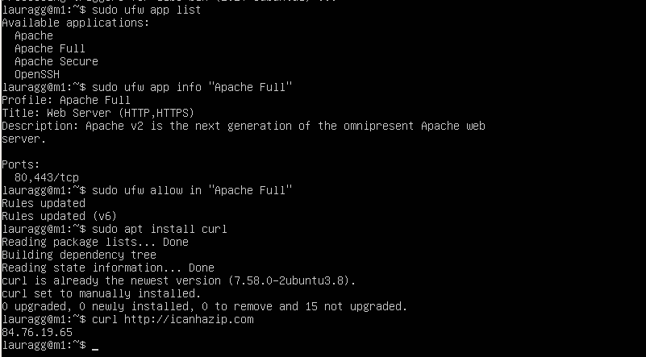
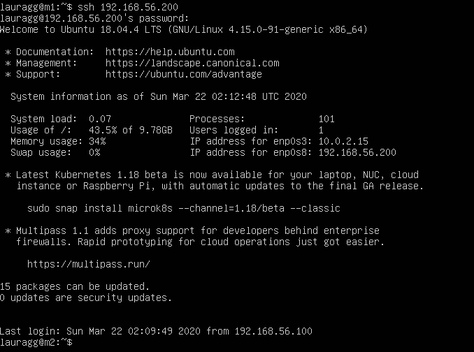

# Práctica 1

**GitHub:** Lauragg

Comenzaremos descargando VirtualBox 6.1.4 r136177 y Ubuntu Server 18.04.4 en nuestro dispositivo que será un portátil ASUS con Ubuntu 18.04.3 con un procesador Intel® Core™ i7-4510U CPU @ 2.00GHz × 4, 7,7GiB de memoria y 983.4GB de disco. Será, en este dispositivo, donde utilizaremos VirtualBox para virtualizar las máquinas que crearemos para la asignatura.

## Creación de las máquinas virtuales M1 y M2
En las imágenes mostraremos el procedimiento seguido tomando como ejemplo la máquina M1. La única diferencia con respecto al procedimiento indicado en el guión, sería que las máquinas han sido creadas con 1024 MB de RAM en lugar de 512 MB, siguiendo con las indicaciones recomendadas por el propio VirtualBox.

## Instalación de Ubuntu Server
A continuación, mostramos el procedimiento seguido para instalar Ubuntu Server. Nótese que SSH es instalado mediante este procedimiento.

## Instalación de programas.
Dicho esto, instalamos apache, php, mysql y curl. Además de asegurarnos de que estos funcionan correctamente.

Aquí obtenemos una imagen sencilla de una web externa, utilizando curl.

## Acceso curl entre máquinas

Sin embargo, si intentamos hacer curl desde m2 hacia m1 para obtener el archivo ejemplo.html veremos que no se realiza la descarga. Esto es por varios motivos, por ejemplo, en este caso podríamos plantearnos hacer curl a través de la dirección **84.76.19.65** la cual, si nos fijamos, es compartida entre nuestras dos máquinas y el host. Si hacemos eso, estaríamos accediendo a nuestro router, pero ahí no tenemos ningún archivo que coincida con el nombre solicitado.

Primero de todo, debemos de configurar la red que comunica m1, m2 y host de acuerdo al esquema del guión de prácticas. De esta forma, podremos realizar la petición curl utilizando este camino que estamos creando. Mostramos cómo sería con m1, sabiendo que con m2 se haría de forma similar.

Una vez hecho esto, ¡funciona! Ya podemos proseguir con el acceso SSH.

## Acceso SSH entre máquinas

Nótese, que estamos utilizando el mismo usuario para ambas máquinas. Si quisiéramos acceder con otro usuario, tendríamos que configurar ssh para admitirle el acceso.

