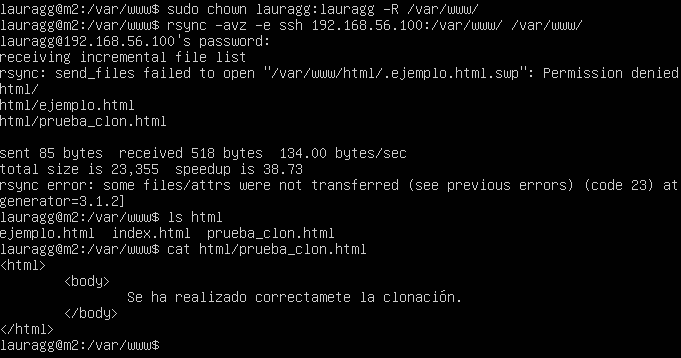
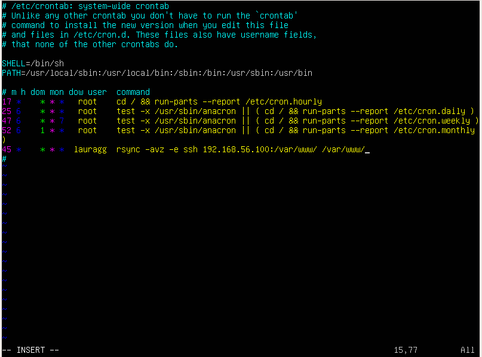

# Práctica 2

**GitHub:** Lauragg

Comenzando por dónde lo dejamos en la práctica anterior, en esta práctica deberemos:
+ Probar el funcionamiento de la copia de archivos por *ssh*.
+ Clonado de una carpeta entre las dos máquinas.
+ Configuración de *ssh* para acceder sin que solicite contraseña.
+ Establecer una tarea en *cron* que se ejecute cada hora para mantener actualizado el contenido del directorio `/var/www` entre las dos máquinas.

Continuaremos, siguiendo las instrucciones del guión.

## Copia de archivos por ssh.

Creamos la carpeta con varios archivos y la enviamos:

Comprobamos que ha llegado con éxito:

## Clonado de una carpeta entre dos máquinas (con rsync)

Lo primero que debemos de hacer es instalar *rsync* en ambas máquinas, utilizando el comando `sudo apt-get install rsync`.

Crearemos un archivo en la carpeta `/var/www` que será la carpeta que clonaremos, para comprobar que efectivamente se ha realizado bien.

A continuación, procedemos a clonar el contenido en nuestra máquina m2. Para ello, primero deberemos darle permisos a nuestro usuario en la carpeta que queremos clonar en la propia m2 y, después, proceder.

Nótese que tenemos un archivo temporal que no ha sido clonado, nuevamente esto es por la falta de permisos en la máquina m1 y podríamos solucionarlo procediendo a dar dichos permisos. Sin embargo, como no estamos interesados en dichos archivos temporales lo dejamos sin cambios.

## Acceso ssh sin contraseña

Ahora buscamos poder acceder a nuestra máquina m1 desde la máquina m2 sin necesidad de introducir ninguna contraseña, para esto utilizaremos el sistema de claves públicas y privadas. Para ello generamos primero las claves en nuestra m2:

Después, indicamos a nuestra m1 mediante `ssh-copy-id` que vamos a subir nuestra clave pública y al no poner argumentos estamos indicando que la tenemos guardada en nuestro pc en la ruta por defecto.

Finalmente, comprobamos que podemos acceder:

## Utilizar cron para mantener actualizado el contenido de ambas carpetas.

Modificamos el archivo `/etc/crontab` y después reiniciamos el servicio con `sudo service cron restart`.

Finalmente, comprobamos el archivo `/var/log/syslog/` para aseguarnos de que funciona correctamente.

 
